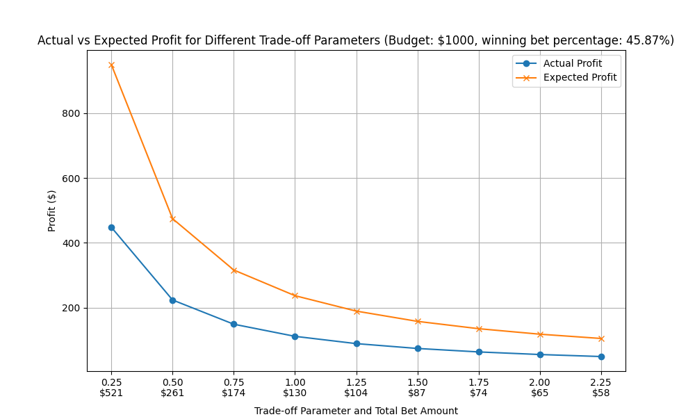
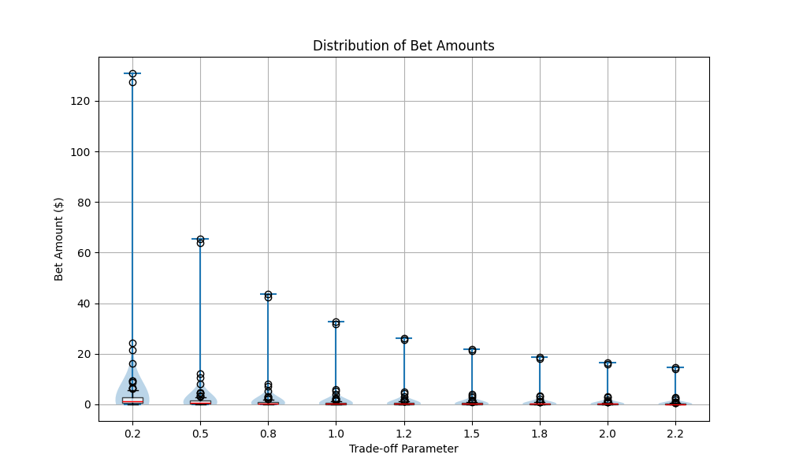

## Setup

Create a new conda environment with python 3.12

```bash
conda create -n bettor python=3.12
conda activate bettor
```

Install the requirments

```bash
python3 -m pip install -r requirements.txt
```

## Usage


### Win Probability Prediction Model

Train a model to obtain win probabilities for a given matchup with

```bash
python3 model.py <data.csv>
```

This will save the model as a pickle file.

### Numerical Solver

Once the win probabilities and payout odds are obtained from the previous steps (TODO), you can run the numerical solver to obtain an optimal portfolio given by following optimization problem

```math
\left.\quad
  \begin{aligned}
  
  & \underset{x\in\mathbb{R}^n}{\text{maximize}}
  && \sum_{i=1}^n \Bigl[x_i\,(p_i\,o_i - 1)\;-\;\lambda\,x_i^2\,o_i^2\,p_i(1-p_i)\Bigr] \\
  & \text{subject to}
  && \sum_{i=1}^n x_i \;\le\; B \\
  &&& x_i \;\ge\; 0,\quad i = 1,\dots,n

  \end{aligned}
\quad\right |
  \begin{aligned}
  & n &&= \text{ number of games}\\
  & B &&= \text{ total budget}\\
  & x_i &&= \text{ bet amount on game }i\\
  & p_i &&= \text{ win‐probability for game }i\\
  & o_i &&= \text{ payout odds for game }i\\
  & \lambda &&= \text{ risk‐tradeoff parameter}\\
  \end{aligned}
```

```bash
python3 solver.py \
  --budget <total budget> \
  --win-probs <sequence of win probs> \
  --payout-odds <sequence of payout odds>
```

### Evaluator

Once the model is obtained, you can test the model and solver on a test set with

```bash
python3 evaluator.py <model> <model_data.csv> <test_data.csv> <budget>
```

#### Example

Testing on 22-23 regular season games. The model is trained on games before January '22 (21-22 regular season) and tested on games during January '23 (22 - 23 regular season).

First obtain a trained model

```bash
python3 model.py data/21_22_pre_jan_data.csv
```

This will save a random forest model as a pickle file.

Then run the evaluator with this trained model, along with betting odds data and a budget

```bash
python3 evaluator.py random_forest_model.pkl data/21_22_pre_jan_data.csv data/22_23_jan_odds.csv 1000

```

The following are the results

</img>
</img>
</img>
